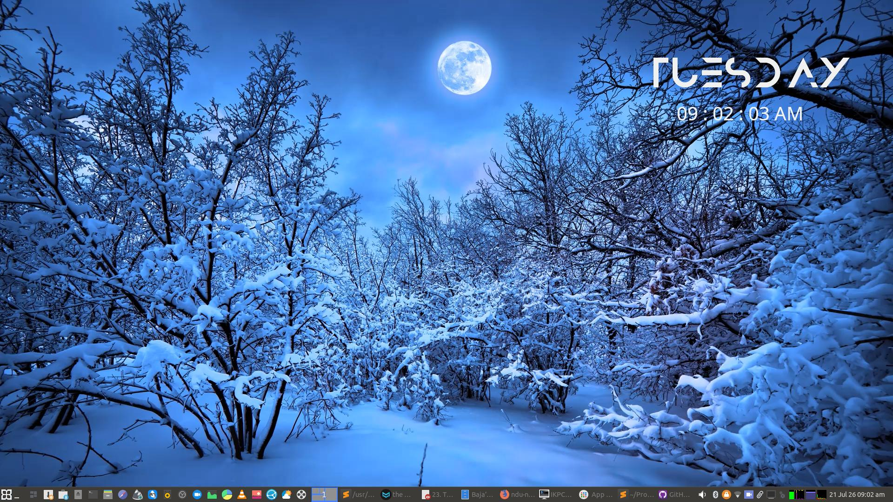

# FluidWall - Dynamic Wallpaper Engine with Conky Integration

A complete solution for dynamic wallpaper management with intelligent contrast-based text coloring for Conky.

> Note
> 
> - was built for live wallpapers with short durations NB: `for every set duration, the script loops the live wallpaper at least once till it duration time is reached.` 

## Overview

FluidWall is a sophisticated wallpaper engine that provides:

- **Dynamic wallpaper cycling** with smooth transitions between images and live videos
- **Intelligent text contrast** - automatically adjusts Conky text color to remain readable against any wallpaper
- **Live video wallpaper support** - seamlessly integrates video clips into your wallpaper rotation
- **Zero-config Conky integration** - no need to edit `.conkyrc` or restart Conky
- **Resource-efficient** - uses caching and pre-generation to minimize CPU/GPU usage
- **GPU acceleration support** - optional VAAPI hardware encoding/decoding

## Components

The system consists of two main components:

### 1. `fluidwall.sh` - The Wallpaper Engine

Manages the wallpaper slideshow with support for static images and live videos, including automatic contrast detection and Conky color updates.

### 2. `conky_helpers.lua` - Conky Integration

Lua script that reads color states and displays dynamic greetings in Conky.

## Requirements

### System Dependencies

```bash
# Core utilities
ffmpeg ffprobe mpv socat yad xwinwrap

# GPU acceleration (optional)
# note this script was built to work with amd/intel gpus for the gpu acceleration option
vainfo mesa-va-drivers intel-media-va-driver

# Build dependencies (for xwinwrap)
git build-essential libx11-dev libxrender-dev x11-xserver-utils
```

## Quick Start

### Initial Setup

```bash
# Navigate to the repository
cd ~/ndu-ndi

# Run the complete setup (installs dependencies, configures Conky, installs font, sets up PATH)
./fluidwall.sh set-install
```

The `set-install` command handles everything automatically:

- Installs all system dependencies
- Backs up and installs the Conky configuration
- Sets up `conky_helpers.lua`
- Downloads and installs the Anurati font
- Adds `fluidwall` to your PATH
- Restarts Conky

### Start the Wallpaper Engine

```bash
# Start with default settings (30-minute interval)
fluidwall start

# Start with custom interval (5 minutes)
fluidwall start --change 5m

# Start with GPU acceleration
fluidwall start --gpu

# Start with CPU-only (override GPU setting)
fluidwall start --no-gpu
```

### Configure Conky (if not using set-install)

Add to your `.conkyrc`:

```lua
# Load the Lua helpers
lua_load ~/.local/run/conky_helpers.lua

# Use in your conky text:
${lua conky_greeting}
${lua_parse conky_color_open}This text adapts to wallpaper contrast${lua_parse conky_color_close}
```

## Detailed Usage

### FluidWall Commands

```bash
# Start/Stop the daemon
fluidwall start [--change DURATION|-c DURATION] [--gpu|--no-gpu]
fluidwall stop
fluidwall restart [--change DURATION|-c DURATION] [--gpu|--no-gpu]

# View status and logs
fluidwall status
fluidwall log
fluidwall live-log                    # View live video scheduling log

# Change settings on the fly
fluidwall change DURATION             # Change interval to DURATION
fluidwall set-live-every N            # Show live video every N images
fluidwall set-pic-dir [DIR]           # Change image directory (opens picker if omitted)
fluidwall set-live-dir [DIR]          # Change video directory (opens picker if omitted)

# Pre-generation and cleanup
fluidwall generate [--gpu|--no-gpu] [--parallel N]
fluidwall generate --clean            # Remove orphaned cached files

# Contrast (text color) settings
fluidwall set-contrast N              # 0=linear inversion, 100=hard black/white (default: 70)
fluidwall show-contrast               # Display current contrast value

# Installation
fluidwall install                     # Install system dependencies only
fluidwall set-install                 # Full setup: install deps, .conkyrc, helpers, font, PATH

# Help
fluidwall help
fluidwall -h
fluidwall --help
```

### Duration Format

Durations can be specified in human-readable format:

- `30s` - 30 seconds
- `5m` - 5 minutes
- `2h` - 2 hours
- `1h-30m` - 1 hour and 30 minutes
- `2h-4m-30s` - 2 hours, 4 minutes, 30 seconds

**Minimum interval**: 60 seconds

### GPU Acceleration Flags

- `--gpu`: Enable VAAPI hardware encoding/decoding (AMD/Intel)
- `--no-gpu`: Force CPU encoding/decoding (overrides saved setting)

The GPU setting persists to `~/.local/run/fluidwall.conf`. Without either flag, the last saved setting is used (default: off).

### Contrast Control

The wallpaper engine automatically adjusts Conky text colors for optimal readability:

- **Contrast value (0-100)**: Controls the mapping from background brightness to text color
  - `0`: Linear inversion (text = 255 - bg)
  - `70` (default): Smooth contrast with balanced saturation
  - `100`: Hard black/white step function

Color transitions are smooth and fixed at speed 20 (1=fast, 100=slow).

## Architecture

### How It Works

1. **Wallpaper Cycling**:
   
   - Scans directories for images and videos
   - Generates short "base clips" (0.5 seconds) of each media
   - Maintains a buffer of pre-generated clips for seamless transitions
   - Uses `mpv` + `xwinwrap` for video playback
   - Applies crossfade transitions between clips

2. **Contrast Detection**:
   
   - Monitors current wallpaper changes
   - Samples average brightness of current image/video
   - Applies sigmoid mapping with configurable contrast value
   - Writes contrast color to `~/.local/run/conky_color.txt`

3. **Conky Integration**:
   
   - Reads color state file on each Conky update
   - Applies color without restarting Conky
   - Rotates greetings from a text file

### Directory Structure

```
~/.local/run/
├── fluidwall.current_img      # Current wallpaper path
├── conky_color.txt            # Current contrast color (hex)
├── fluidwall.pid              # Daemon PID
├── fluidwall_mpv.sock         # MPV IPC socket
├── fluidwall.conf             # Configuration (interval, live_every, GPU)
└── conky_helpers.lua          # Lua helper script

~/.config/wallpaper_contrast/
└── skew.conf                  # Contrast value (0-100)

~/Pictures/wallpaper_engine/   # Generated clip cache
├── bases/                     # 0.5s base clips of images
├── clips/                     # Live video head/tail clips
└── brightness/                # Cached brightness values

/tmp/fluidwall_ram_*/          # RAM cache for active clips
/tmp/wallpaper_engine/         # Transition clips cache
```

## Performance Optimization

### GPU Acceleration

Enable hardware encoding/decoding for better performance:

```bash
fluidwall start --gpu
```

### Pre-Generation

Generate all clips in advance to avoid startup delays:

```bash
fluidwall generate --parallel 4
```

### Memory Usage

- Base clips are cached in RAM (`/tmp/fluidwall_ram_*/`)
- Only `PREGEN_COUNT` clips are kept in memory (default: 3)
- Default buffer: ~10-15MB per clip

### Buffer Management

The system maintains a rolling buffer of `PREGEN_COUNT` distinct steps queued ahead of playback. Each step represents one displayed item (image or live video segment) and is enqueued as a single playlist entry using mpv's built-in loop feature.

## Troubleshooting

### Common Issues

**Wallpaper not changing:**

```bash
# Check if daemon is running
fluidwall status

# Check logs for errors
fluidwall log

# Restart the daemon
fluidwall restart
```

**Conky color not updating:**

```bash
# Check if daemon is running
fluidwall status

# View current contrast setting
fluidwall show-contrast

# Force color update by adjusting contrast
fluidwall set-contrast 50
```

**Video wallpapers not working:**

```bash
# Verify xwinwrap is installed
which xwinwrap

# Check GPU/VAAPI setup
vainfo

# Fall back to CPU
fluidwall restart --no-gpu
```

**Memory/CPU issues:**

```bash
# Reduce parallel generation jobs
fluidwall generate --parallel 1
```

## Advanced Configuration

### Custom Image and Video Directories

```bash
# Set directories (opens picker if no argument provided)
fluidwall set-pic-dir ~/Pictures/Wallpapers
fluidwall set-live-dir ~/Videos/LiveWallpapers
```

### Live Video Scheduling

```bash
# Show live video every N static images
fluidwall set-live-every 3

# Disable live videos
fluidwall set-live-every 0
```

## License

These scripts are provided as-is. Feel free to modify and distribute.

## Appreciations

- many thanks to [shuokenzi23](https://github.com/shuokenzi23/minimal-clock.git) whose work inspired this script

## Contributing

Suggestions and improvements welcome! Key areas for contribution:

- Additional transition effects
- More color mapping algorithms
- Support for more video formats
- Integration with other desktop environments

---

### preview image



### preview video


**Note**: This system was designed for X11 environments and intel/amd GPUs. Support for nvidea coming soon. Wayland support may require additional configuration.
